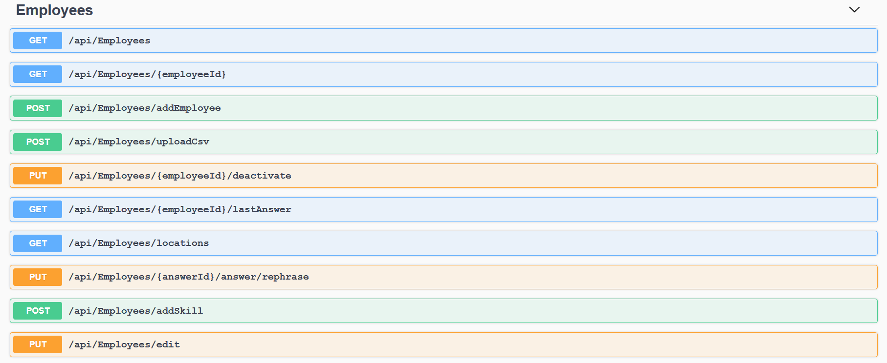
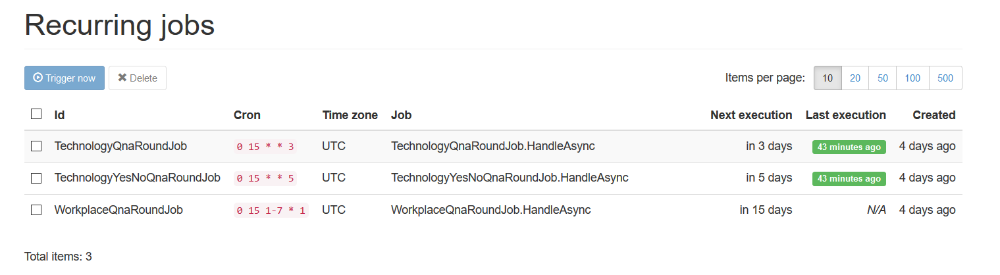
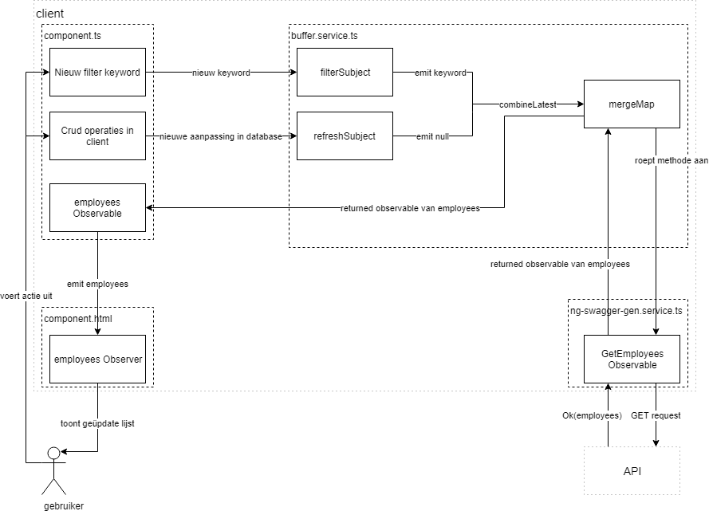

# Ontwikkeling

In deze sectie wordt de praktische uitvoering van het project, tegengekomen moeilijkheden en de implementatie van externe bibliotheken en hun nut voor het project toegelicht. De beschrijving gebeurt op een zo chronologisch mogelijke wijze. Structureel kan de implementatie opgedeeld worden als volgt:
 
* Architectuur
* Authenticatie & Authorisatie
* Backend
* Frontend
 
In het stuk backend zal alle core functionaliteit toegelicht worden, en bij frontend en slackbot zal hoofdzakelijk de presentatie en consumptie van de ter beschikking gestelde functionaliteit besproken worden.
 
## Architectuur {#arch}
 
De samenstelling van de backend van het project kan gezien worden als een backend systeem met meerdere componenten (onze microservices). In de praktijk manifesteert dit zich als een visual studio solution met aanhangende project files. Voor de benaming geldt de namespace Involved.BrainChain.<componentnaam>.
 
Een database-component voor het aanmaken van de database en toepassen van migraties via FluentMigrator en aanmaken van seeddata voor testing doeleinden.
Een domein-component die de business logic en het contextueel aanspreken van de database op programmatisch niveau omvat.
Een API-component als interface waarlangs de applicatie de CRUD-functionaliteit zal publiceren aan de ‘client’ applicatie voor gegevensadministratie, en die alsook de communicatie met het Slack API zal verzorgen.
Een scheduler-component dat via webjobs getimede opdrachten voor de slackbot zal voorzien (de interne logica van de opdrachten blijft weliswaar op domein-niveau).
Een Slack integratie component dat een ‘client’ voorziet die kan communiceren met de Slack API. Dit staat los van de API-component als designkeuze om de slack-integratie hoge herbruikbaarheid te geven.
Bijbehorende test-componenten voor de individuele projecten van de ‘solution’ waar testbaarheid nodig en mogelijk is:
* API unit tests
* API integration tests
* Domain unit tests
 
Er is in het project over het algemeen een hoge graad van **loose-coupling** bereikt. Dit is dankzij het gebruik van het mediator design-patroon om alle verwerkingen in het domein onrechtstreeks aan te roepen via ‘handlers’ en dankzij het extensief gebruik van ‘Dependency Injection’ om gemaakte services alleen waar nodig ter beschikking te stellen.

### Authenticatie en Autorisatie {#auth}

Authenticatie en autorisatie in onze applicatie wordt afgehandeld door auth0. Auth0 is een management platform voor authenticatie en autorisatie. Via het online platform wordt de autorisatie van de applicatie en de gebruikers geconfigureerd. Vanuit de applicatie zelf kan de configuratie aangepast worden met behulp van de management API van auth0.

Gebruikers worden geauthenticeerd met de universele login van auth0. Wanneer gebruikers een authenticatie request triggeren worden ze doorverwezen naar de universele login pagina van auth0. Deze pagina wordt enkel gebruikt voor inloggen en authenticatie, en toont het lock widget van auth0. Andere logica is niet beschikbaar op deze pagina.
De hoofdreden waarom er gebruik gemaakt wordt van universele login, is veiligheid. De universele login zorgt ervoor dat de applicatie geen gebruik maakt van cross-origin authenticatie. Cross-origin authenticatie is in se gevaarlijker en heeft een grotere kans om het slachtoffer te zijn van, onder andere, een man-in-the-middle aanval (Auth0 Documentatie, s.d.).

Wanneer de authenticatie geslaagd is, wordt het access token en de datum en tijd wanneer het token vervalt, ontvangen van auth0, opgeslagen in de browser cache via de localStorage tool van Angular. Deze tokens vervallen na tien uur.

De routes in de client side van de applicatie worden beschermd door de authGuard service. De service kijkt of er zich een accestoken bevindt in de local storage, en of dit token nog niet vervallen is. Zo ja, wordt de gebruiker weer doorverwezen naar de login pagina. Aangezien er maar één soort gebruiker toegang heeft tot de client side van de applicatie, namelijk de beheerder, heeft een geauthenticeerde gebruiker toegang tot alle pagina’s van de website.

In de backend van de applicatie worden alle controllers, buiten de Slack controller, in de API beschermd door autorisatie. Er kunnen dus geen ongeautoriseerde calls gemaakt worden vanuit de client. Calls die worden gemaakt vanuit de frontend worden in de client onderschept door een HttpInterceptor. Deze service zorgt ervoor dat het accestoken als bearer token wordt meegegeven aan de header van de call, alvorens ze naar de backend worden gestuurd. De backend checkt dan met behulp van de Authorization API van auth0 of de gebruiker deze call mag maken. In de huidige iteratie van het project, heeft een geauthenticeerde gebruiker toegang tot alle methodes van elke controller, buiten de Slack controller.
 
### Backend {#backend}
 
### Domein & database configuratie {#domain}
 
Als één van de allereerste stappen werd het domein opgesteld. Daarbij werden de tabellen van het initiële ‘database model design’ geïmplementeerd als domein entiteiten volgens de ‘Entity Framework’-werkwijze. Tegelijkertijd werd FluentMigrator geïnstalleerd, geïntegreerd met de IServiceCollection van ASP.NET Core en werd de eerste database migratie -M001_Initial- geschreven. Hieronder een voorbeeld van de aanmaak van een databasetabel in FluentMigrator-syntax.
 
```cs
Create.Table("Employee")
.WithColumn("Id").AsInt32().PrimaryKey().Identity()
.WithColumn("Name").AsString()
.WithColumn("Location").AsString()
```
 
waar geldt:
* PrimaryKey() definieert de primaire sleutel
* Identity() definieert de identificerende waarde, en zal deze ook automatisch genereren zonder aangegeven waarde
* As<type>() definieert de zelf beschrijvende gegevenstype
 
Het initiële bijbehorende domeinmodel is dan een simpele klasse met alle nodige properties als C# properties met een public ‘get’ maar private ‘set’ (dit omdat het rechtstreekse schrijven naar domeinmodellen volledig afgescheiden dient te zijn van buitenaf), gekoppeld aan een  constructor die de vereiste properties beschikbaar maakt voor de aanmaaklogica.
 
Voor het ‘mappen’ van de tabellen naar Entity Framework, is het gebruik van Data Annotations vermeden aangezien dit het ‘Separation of Concerns’-principe zou schenden, eerder vernoemd onder sectie Analyse -> Design database. Ook de standaard functie 'OnModelCreating' van de Entity Framework DatabaseContext klasse wordt vermeden daar dit vlug te groot en onoverzichtelijk zou worden met de evolutie van de applicatie. Het mappen gebeurt door middel van aparte files, georganiseerd per Entity Model / Database tabel, bij het opvragen van de Entity Framework ‘IEntityTypeConfiguration’-interface.
 
 
```cs
public class EmployeeConfig : IEntityTypeConfiguration<Employee>
{
    public void Configure(EntityTypeBuilder<Employee> builder)
    {
        builder.ToTable("Employee").HasKey(e => e.Id);
    }
}
```

### Communicatie API en Domein & lijst werknemers {#lijstmedewerkers}
 
Op basis van wat initiële seed-data in de vorm van een simpel SQL script, werd dummy data voor employees toegevoegd en op basis hiervan de eerste feature toegevoegd: een lees-actie naar tabel ‘employee’ via een DatabaseContext van Entity Framework, langsheen een MediatR handler loosely-coupled naar een API interface endpoint in het API project, waar het beschikbaar gesteld is voor consumptie door de frontend. Deze werkwijze zal herhaald worden voor alle lees- en schrijfoperaties die via de client-applicatie moeten binnenkomen. Zo een operatie ziet er als volgt uit (beginnend met de MediatR handler op domein-niveau, die in deze applicatie uit 3 delen bestaat):
 
```cs 
public class GetAllEmployeesResponse
{
    public IEnumerable<Employee> Employees { get; set; }
}
```
 
Een voor gedefinieerde response, het verwachte antwoord dat de handler zal terugsturen naar de aanroepende code.
 
```cs
public class GetAllEmployeesRequest : IRequest<GetEmployeesByLocationResponse>
{
    public int CompanyId { get; set; }
}
```

Een implementatie van de MediatR ‘IRequest’-interface, waar de nodige data velden aangegeven worden om een verzoek te voltooien. Dit werkt tevens ook als het aanspreekpunt van de gehele handler: het aanmaken van een nieuwe IRequest implementatie zal deze handler tewerkstellen. Merk ook het meegeven van het vooraf gedefinieerde Response in de Request op.
 
```cs
public class GetAllEmployees : IRequestHandler<GetEmployeesByLocationRequest, GetEmployeesByLocationResponse>
{
private readonly BrainChainContext _context;

public GetAllEmployees(BrainChainContext context)
{
_context = context;
}

public async Task<GetAllEmployeesResponse> Handle(GetAllEmployeesRequest request, CancellationToken cancellationToken)
{
var company = await _context.Companies.Include(c => c.Employees).SingleOrDefaultAsync(c => c.Id == request.CompanyId, cancellationToken);
var employees = company.EmployedEmployees;

return new GetAllEmployeesResponse()
{
Employees = employees,
};
}
}
```

Een implementatie van MediatR ‘IRequestHandler’, dat de interne business-logica en database operations bevat. Merk op dat er asynchroon wordt gewerkt, wat zal gelden voor alle soortgelijke handlers en hun aanspreekpunten. Data-ophaling en -manipulatie gebeurt met LINQ syntax, het veelgebruikte data querying framework van Microsoft .NET. Merk tenslotte ook het gebruik van Dependency Injection op om de database-context als nodig ter beschikking te stellen. 'BrainChainContext' is in dit geval de algemene implementatie van het Entity Framework 'DbContext' waar de entity models worden gedefinieerd, en waar de eerder vermelde EF <-> database mappings worden toegepast.
Deze handler wordt dan aangesproken door middel van requests in de rest van de applicatie waar nodig. Het API endpoint om dit specifiek stuk functionaliteit aan te spreken is een implementatie van het .NET Core 'Controller' klasse. Er bestaat voor elke hoofdzakelijke entity model een eigen controller, bv. EmployeeController, met toebehorende gepubliceerde functionaliteit. Zo een controller, in dit geval horend bij de reeds aangegeven domein handler, ziet er als volgt uit:
 
```cs
[HttpGet]
public async Task<ActionResult<IEnumerable<EmployeeDto>>> GetEmployeesByLocation(int companyId)
{
if (companyId == 0) return BadRequest("No companyId provided.");
 
var res = await _mediator.Send(new GetAllEmployeesRequest()
{
CompanyId = companyId
});
 
var employees = _mapper.Map<IEnumerable<EmployeeDto>>(res.Employees);
return Ok(employees);
}
```

 
Een [HttpGet] decorator van het .NET framework duidt dit endpoint aan als een RESTful GET webservice. Merk het gebruik van de ‘IRequest’-implementatie (GetAllEmployeesRequest()) in onze handler op: dit is het punt waar de voordien beschreven handler aangesproken en in actie gezet wordt. Eens de data succesvol opgehaald is, laten we dit alleen zien als een apart gedefinieerde Data Transfer Object (EmployeeDto). Data Transfer Objects zijn klassen die slechts gedeeltelijk eigenschappen van entity models gebruiken om deze te versturen of te ontvangen, zodat onze domeinmodellen nooit onnodig aan externen worden blootgesteld, en dat er geen onnodige informatie wordt verwisseld. Voor het omzetten van deze domeinmodellen naar de DTO's (en terug), is er gebruik gemaakt van Automapper, een .NET bibliotheek welke toelaat mapping profielen te configureren waarin er gedefinieerd wordt welke DTO bij welk model hoort, en er geen nood is om bij elke conversie manueel de properties zelf in te vullen (en potentieel meer fouten te maken).
 
Vrijwel alle functionaliteiten gekoppeld aan de backend en de ‘client’-applicatie zullen het hierboven beschreven patroon volgen. Van toekomstige code snippets van interne business- logica kan verwacht worden dat ze in een dergelijke domein handler zitten, en hun aanspraakpunt in een dergelijke API interface.
 
### Swagger {#swagger}
 
Voor het publiceren van de aangemaakte API endpoints, is er gebruik gemaakt van Swagger. Dit is kort samengevat een open-source framework beschikbaar op veel platforms welke automatisch RESTful web services kan documenteren en zelfs bijhorende frontend code genereren voor consumptie. De .NET Core implementatie dat is gekozen voor dit project is Swashbuckle, welke alleen diende toegevoegd te worden als een service, en erna een swagger.json bestand genereert gebaseerd op de code in onze controllers. Uit dit json bestand wordt dan een HTML pagina met documentatie en testmogelijkheden aangemaakt welke op het adres van ons backend toegankelijk is. Dit ziet er in het finale product zo uit voor de employee controller:


*Fig. 2 Gegenereerde swagger documentatie van Employee Controller*

Verder kan er dan ook frontend code gegenereerd worden uit deze swagger.json bestand. Deze werking zal later toegelicht worden.

### Formulier nieuwe werknemer {#medewerkerform}

Als tweede concrete feature is er de mogelijk toegevoegd tot het manueel toevoegen van een nieuwe werknemer. Dit zou de eerste schrijf-operatie worden en ging dus ook validatie logica nodig hebben (er kan tenslotte niet zomaar van elke API call eender welke data geaccepteerd worden). Data validatie gebeurt op 2 niveaus: op de web service (waar een niet-geslaagde validatie een web response geeft) en in het domein (waar een niet valide staat een interne server error zal geven).

**Web Service**: Er zijn 3 validatie services voorzien, geïmplementeerd als static klasses die we aanroepen in de [HttpPost] Task:
* Een geboortedatum validator, welke op formaat controleert (dd/mm/yyyy) gebaseerd op DateTime
* Een email validator, welke op formaat controleert (naam@email.domein) gebaseerd op een Regex met acceptabele tekens
* Een naam validator, welke op aanwezigheid van een naam controleert (= niet leeg of null).

**Domein**: Om het proces van toevoegen in gang te zetten, moet er een nieuw Employee object geconstrueerd worden. Deze constructor bevat volgende validaties:
* Naam: mag niet null zijn (anders -> ArgumentNullException(nameof(name)))
* Email: mag niet null zijn, en nog een interne formatteringsvalidatie tegen een Regex
* Birthdate: mag niet null zijn

**Domein Handler**: Als laatste validatie gebeurt er in de business logica een duplicaat check met LINQ syntax. Het tabel 'employees' van de databasecontext wordt eerst doorzocht op een bestaande record met identieke naam EN email (een werknemer mag dezelfde naam of email hebben). Indien duplicaat, loggen we een error met de nodige informatie (naam + email + companyId).

Als deze validatie succesvol plaatsvindt, mag de toevoeging van een werknemer pas plaatsvinden. Er zal soortgelijke uitgebreide validatie uitgevoerd worden voor schrijf operaties waar sprake is van gebruik van formulieren, uit het principe van nooit zomaar client input te vertrouwen. De eigenlijke toevoeging gebeurt vanuit het perspectief van het bedrijf: eerst zoeken we deze op met de contextuele companyId, waarop in dit Company object de nieuwe werknemer aan de collectie 'Employees' toegevoegd wordt, welke zich dan via Entity Framework (na een aanroep naar context.SaveChanges) ook zal vertalen naar de nodige database operatie.

Bij de ontwikkeling van deze feature is al reeds een refactor toegepast. In het initiële domein model werd er nog over een eigenschap 'Age' gesproken bij een employee, maar dit is veranderd geweest naar 'Birthdate' waarvan we eventueel de leeftijd kunnen afleiden. Dit was één van de eerste van vele refactors dat de agile manier van werken kenmerkt. Ook de duplicaat validatie is eigenlijk in de volgende iteratie geïmplementeerd geweest.

### CSV Upload {#csv}

De gebruiker van de client applicatie moet op een gemakkelijke manier alle medewerkers van zijn bedrijf kunnen toevoegen. Daarom is er een optie voorzien in het beheerscherm van de medewerkers om een CSV-bestand te uploaden.

Dit bestand wordt met een request in een POST request doorgestuurd naar de web API. In de backend wordt het bestand met behulp van de .NET library CsvHelper omgezet naar een lijst van medewerkers. CsvHelper heeft een methode om data in een CSV-bestand lijn per lijn uit te lezen en te mappen naar een DTO, onder voorwaarde dat de titel van elke kolom gelijk is aan de property’s van de DTO. Is dit niet het geval, wordt er een foutmelding gegenereerd dat de kolommen in het bestand niet voldoen aan de verwachte property’s.

De lijst van DTO’s gegenereerd door de service wordt vervolgens gevalideerd. Ieder item in de lijst wordt gecontroleerd of het voldoet aan de voorwaarden die nodig zijn om een medewerker aan te maken (bijvoorbeeld de naam mag geen lege string zijn). Als er zich ergens in het bestand foute data bevindt, zal de gebruiker een foutmelding krijgen met het adres van de foute data (rijnummer en kolomnaam).

Slechts als de lijst gevalideerd is zal er een request worden gemaakt om een lijst van medewerkers te creëren in de databank.

### Deactiveren van werknemers {#Delete}

Bij deze stap werd er de mogelijkheid tot 'verwijderen' van employees toegevoegd. Praktisch passen we dit toe met de toevoeging van een 'IsActive' vlag in het domein model, welke standaard op True staat en bij gebruik van deze functie op False wordt gezet. Om de gewenste werking te bekomen werd dan ook de reeds bestaande GetAllEmployees functionaliteit aangepast op domein niveau om alleen employees die actief staan mee te geven. Een eigenlijke de-activatie gebeurt dan via een simpele RESTful web service met een employeeId parameter die deze doorgeeft aan zijn respectieve domein handler, waarin de employee opgehaald wordt en zijn IsActive eigenschap op False word gezet.

### Slack Integratie {#slack}

Om data te verkrijgen van medewerkers van het bedrijf hebben is er een Slack applicatie gecreëerd als onderdeel van het project.

Slack laat zijn gebruikers toe om applicatie toe te voegen aan de workspace. Zo kan men de functionaliteit van een workspace uitbreiden en veranderen.
In de Slack applicatie is er een bot user gebundeld. Deze bot zorgt ervoor dat medewerkers via conversaties kunnen interageren met de Slack app.
De Slack app maakt gebruik van twee Slack API’s om interacties met medewerkers af te handelen, de Events API en de Conversations API.

#### Events API
De Events API zorgt ervoor dat een Slack app zich kan abonneren op events die gebeuren in Slack. In de Slack app geven we een request URL mee.
Om te verifiëren of deze URL geldig is stuurt Slack POST request met als type: url_verification en een willekeurige challenge string. Om de verificatie te voltooien moet de web API met een OK-response antwoorden, met een response body die de challenge string bevat. (Slack Api, s.d.)

Wanneer er een event gebeurt waarop we geabonneerd zijn, stuurt Slack een POST request naar de URL. De requests zijn JSON requests. De request URL komt overeen met een methode in de Slack controller van de web API. Slack verwacht dat er binnen de drie seconden gereageerd wordt met een 2XX response code. Lukt dit niet, zal de Events API maximaal drie keer proberen om de request naar de request-URL te sturen. Het is dus belangrijk dat de web API zo snel mogelijk antwoord op een request. Hierom moet er zoveel mogelijk vermeden worden dat het verwerken van een event en het beantwoorden op een event in hetzelfde proces gebeuren.
De Slack app kan zich op twee verschillende soorten events abonneren., Workspace Events en Bot Events.

Workspace Events zijn alle soorten events die kunnen plaatsnemen in een Slack Workspace. Deze events zijn echter niet relevant voor deze applicatie.

Bot Events zijn alle events die gerelateerd zijn aan kanalen en conversaties waar de bot deel van uitmaakt. Het enige event waarop de Slack app geabonneerd is, is het Bot Event: message.im. Dit event ontstaat wanneer er een bericht wordt gestuurd in een direct message kanaal, waar de bot deel van uitmaakt.

De web API checkt het type van de request die gestuurd is naar de request URL, om te weten of de request al dan niet verwerkt moet worden. De API is enkel in staat om requests met als type: url_verification (zoals hierboven geschreven wordt dit gebruikt om de request URL te verifiëren), en requests die een event hebben met als channel type: im (dit toont aan dat het event afkomstig is van een direct message channel), te verwerken. Als de controller een request ontvangt dat niet verwerkt kan worden, zal de methode een exception throwen.

De manieren waarop de requests worden afgehandeld, komt in andere secties van de scriptie aan bod.

### Werking scheduler & eerste bevraging {#scheduler}

De eerste feature in betrekking tot de chatbot van deze applicatie is het systematisch bevragen van de werknemers in hun Slack workspace over hun huidige werkplaats op een bepaald tijdsschema (Elke eerste maandag van de maand om 15:00). Praktisch is dit toegepast met het gebruik van Hangfire: een .NET framework voor het opzetten van (onder andere) herhalende taken. Deze worden dan als persistente data mee opgeslagen in de SQL server. Hangfire voorziet ook een grafische dashboard dat kan bezocht worden op de server waar de aangemaakte jobs kunnen bekeken en manueel getriggerd worden (zeer nuttig voor testing doeleinden).

Als deel van de design van het project is Hangfire geïmplementeerd in een eigen projectfile Involved.BrainChain.Scheduler. In plaats van elke nieuwe job manueel toe te voegen, is er om jobs automatisch te registreren een custom JobRegistrator klasse geschreven geweest, welke via het type assembly zoekt voor implementaties van het hangfire IJob interface en deze automatisch gevonden jobs aan de recurringJobManager van Hangfire toevoegd.

De eerste job, om werknemers te bevragen over hun werkplaats, zag er dan zo uit:

```cs
namespace Involved.BrainChain.Scheduler.Jobs
{
    // At 15:00 on day-of-month 1
    [Interval("0 15 1 * *")]
    public class EmployeeLocationJob : IJob
    {
        private readonly IMediator _mediator;

        public EmployeeLocationJob(IMediator mediator)
        {
            _mediator = mediator;
        }

        public async Task HandleAsync()
        {
            var res = await _mediator.Send(new AskEmployeeForLocationRequest());
            if (res.Failed) throw new Exception("These employees could not be questioned: " + res.FailedEmployees);
        }
    }
}
```

Hier valt op te merken:

* De job is gedecoreerd met een zogenoemde CRON-notatie. IntervalAttribute is een custom geschreven implementatie van Attribute om deze notatie met de jobs mee te geven naar Hangfire, welke deze weet te interpreteren. Zie [hier](https://crontab.guru/) [^1] voor een voorbeeld van een site waar cron notaties kunnen gevormd worden. Het merkbare nadeel hier is dat dit op zich niet heel leesbaar is in de code zonder de betekenis op te zoeken.
* Ook hier wordt de koppeling naar het domein volgens het zelfde principe als de andere microservices geïmplementeerd: loosely-coupled via MediatR.

Het Hangfire dashboard in de huidige acceptatie omgeving ziet deze job er als volgt uit:



*Fig 3. Hangfire dashboard van de scheduler op acceptatie*

Wanneer deze job dan getriggerd wordt, gebeurt de invocatie van de geassocieerde domein handler. Deze bevat logica om eerst alle werknemers van het bedrijf uit de database te halen, en vervolgens ze allemaal iteratief een bericht te sturen via een vraag. Deze berichten sturen gebeurt via een zelfgeschreven 'SlackClient', een klasse die we beschikbaar stellen als injecteerbare interface ISlackClient die http calls naar het Slack API beschikbaar stelt. De gebruikte httpClient in SlackClient is voorgeconfigureerd in Startup.cs met het autorisatie token om met de relevante workspace slackbot te kunnen verbinden (opgeslagen in appsettings.json), om communicatie mogelijk te maken via de chatbot.

```cs
services.AddHttpClient<SlackClient>(c =>
{
    c.DefaultRequestHeaders.Authorization =
        AuthenticationHeaderValue.Parse("Bearer " + Configuration.GetSection("Tokens")["InvolvedSlack"]);
    c.BaseAddress = new Uri(Configuration.GetSection("Uris")["InvolvedSlackUri"]);
});
```

Deze SlackClient voorziet dan de verschillende nodige functies van de slackbot en formatteert berichten, waar we in dit geval als eerste 'chat.postMessage' [^2] toepassen om de opgehaalde lijst gebruikers af te gaan en hen privé berichten te sturen met de vraag. We verzamelen overigens de pogingen in een array van booleans om bij te houden welke werknemers kunnen bereikt worden, en welke niet (Fout slackId, niet meer in dienst,...). Deze business logica binnenin de handler ziet in zijn implementatie er als volgt uit:

```cs
var employees = await _context.Employees.ToListAsync(cancellationToken);
var messageText = request.Question;

var requests = await Task.WhenAll(employees.Select(e => _slackClient.PostMessage(e.SlackId, messageText)));
var failedEmployees = new StringBuilder();

foreach (var employee in employees)
{
    var i = employees.IndexOf(employee);
    var success = requests[i];

    if (success) employee.HasBeenSuccessfullyQuestioned();
    else failedEmployees.AppendLine(employee.Name);
}

await _context.SaveChangesAsync(cancellationToken);

return new AskEmployeeForLocationResponse()
{
    Failed = requests.Any(success => !success),
    FailedEmployees = failedEmployees.ToString()
};
```

Om te werken met bevragingen van de werknemers, moesten er enkele velden toegevoegd worden aan het domein model van 'employee', welke hierboven aangepast of gebruikt  worden als nodig:

* SlackId: nodig om met de werknemer te communiceren in de Slack workspace.
* LastQuestioned: een DateTime veld om bij te houden wanneer deze werknemer al eens bevraagd is geweest.

Toekomstige beschreven scheduler jobs zullen ook de hierin beschreven werkwijze volgen, met een MediatR call naar domein logica. Ook de aangemaakte SlackClient service zal uitgebreid en hergebruikt worden naarmate de features van de applicatie evolueren.

### Antwoorden verwerken {#processanswer}

De werknemers kunnen nu een vraag ontvangen over hun werkplaats, maar het systeem moet ook antwoorden kunnen detecteren en verwerken. Dit is apart geïmplementeerd geweest (maar wel als volgende stap na de vragen uit sturen) omdat de functionaliteit in een ander deel van de applicatie hoort: bij het sturen van een vraag wordt er beroep gedaan op rechtstreekse API calls naar slack met het security token, aangestuurd door de scheduler, maar om antwoorden te accepteren moet er 'geluisterd' worden op de juiste channels in de slack workspace en deze berichten opgevangen door een API. Slack voorziet zelf met zijn app functionaliteit de mogelijkheid om te reageren op verschillende soorten events die de workspace bot ontvangt. Eén van deze zijn 'events', waaronder ook nieuwe berichten vallen. Hiervoor kan dan een endpoint ingevuld worden waar Slack berichten naar stuurt met alle relevante gegevens in JSON-formaat. Zo een endpoint ziet er dan in de praktijk uit als een API controller, maar deze wordt dan niet gepubliceerd (Alleen de slack workspace app hoeft te weten van deze toegang tot de applicatie). 

```cs
[HttpPost("/slack/event")]
public async Task<ActionResult<string>> Event([FromBody]SlackRequest request)
{
    var handler = _eventHandlers.SingleOrDefault(h => h.CanHandle(request)) ??
                  throw new InvalidOperationException("No matching slack handler found");
    var response = await handler.Handle(request);
    return Ok(response);
}
```
    
Verdere afhandeling van een binnenkomende Slack event gebeurt via zelfgeschreven eventhandlers. Deze dienen niet verward te worden met de MediatR handlers op domein niveau, welke een implementatie van het mediator patroon mogelijk maken. Alle geïmplementeerde handlers worden samengebundeld in een collectie die geïnjecteerd wordt in de SlackController, welke we dan eenvoudig via een LINQ command kunnen afgaan op hun CanHandle methodes. Dit is het stuk logica van de handlers die laat weten of het het inkomende bericht kan verwerken. Er wordt gecontroleerd op twee zaken: het type van het bericht (dit mag alleen "event_callback" zijn, het door Slack gedefinieerde type voor events zoals berichten), en het channel_type van de oorsprong van het bericht (in dit geval "im", voor privé berichten). Dit zijn allebei 2 van vele beschikbare eigenschappen die Slack meestuurt in hun JSON berichten om het soort bericht te kunnen analyseren. Als het bericht voldoet aan de checks van zo een handler, wordt de Handle() methode aangeroepen, welke voor deze feature eerst nog controleert of het SlackId van de verstuurder niet dat van de Slackbot is (anders geraakte hij vast in een oneindige loop van berichten naar zichzelf sturen), en vervolgens de bijhorende domein logica activeert via een MediatR handler.

```cs
public class WorkplaceAnswerHandler : ISlackEventHandler
{
    private readonly IMediator _mediator;
    private readonly Slackbot _slackbot;
    public WorkplaceAnswerHandler(IMediator mediator, Slackbot slackbot)
    {
        _mediator = mediator;
        _slackbot = slackbot;
    }
    
    public bool CanHandle(SlackRequest request)
    {
        return request.Type == "event_callback" && request.Event.Channel_type == "im";
    }
    
    public async Task<string> Handle(SlackRequest request)
    {
        if (request.Event.User != _slackbot.Id)
        {
            var res = await _mediator.Send(new UpdateLocationRequest(request.Event.Text, request.Event.User, request.Event.Channel));
        }
        return null;
    }
}
```

Deze domein handler bevat dan de interne logica om op basis van de SlackId eerst de werknemer op te halen, en dan te controleren of hij al geantwoord heeft. Hiervoor is er in het domein model 'employee' en bijhorende database tabel nog een veld HasAnswered bijgevoegd en een bijhorende methode om deze bij een succesvolle database operatie op True te zetten. Er is dan ook teruggegaan naar de implementatie van de Scheduler job om werknemers te bevragen, om bij het afvuren van nieuwe vragen deze vlag op False te zetten bij bevraagde werknemers. Als de werknemer dan nog niet geantwoord heeft, mag de locatie geüpdatet worden, en roepen we de functie van de werknemer aan om aan te geven dat er geantwoord is geweest, en overigens ook het gegeven antwoord nog op te slaan. We houden immers in de databank ook alle verstuurde antwoorden van werknemers bij, welke later nog zullen bekeken kunnen worden in de client applicatie.

### Laatst gegeven antwoord {#lastanswer}

Er moet een mogelijkheid toegevoegd worden tot het opvragen en weergeven van het laatste antwoord dat een werknemer heeft gestuurd naar de slackbot. Hier is een RESTful web service voor toegevoegd aan de employee API controller om op basis van het Id van de werknemer een verzoek te sturen naar de handler in het domein (GetAnswer) welke de laatste toevoeging in de ICollection<Answer> Answers van de opgehaalde werknemer teruggeeft aan de controller. Deze sturen we dan terug naar de consumer van het API via een DTO welke het Answer domein entity vertegenwoordigt.
    
### Technologienaam wijzigen {#changename}

Er is functionaliteit nodig om de naam van een technologie na het aanmaken ook terug te wijzigen. Hiervoor is in het domain entity 'Technology' een functie toegevoegd welke de naam kan aanpassen. Een domein handler voorziet dan de logica om de technology op basis van zijn id op te halen en deze rename functie aan te roepen. Ten slotte stellen we dit beschikbaar aan de consumer door een [HttpPut] service in de Technology controller welke deze via MediatR aanroept, en indien succesvol, Httpstatuscode 202 (OK) terugstuurt.

### Werknemers bevragen over technologie {#technologyjob}

BrainChain's Slackbot moet ook werknemers over hun affiniteit met technologieën kunnen bevragen. Nog een mogelijkheid van het Slack API zijn de zogenoemde 'interactive components'. Dit maakt het mogelijk om interactieve dialogen met knoppen te construeren en verzenden. [^3] Als hier dan een actie wordt ondernomen, zal dit gelijkaardig aan events (bericht sturen,...) een HTTP Post naar een door ons gedefinieerde URL gestuurd worden met de relevante informatie. Dit heeft zijn eigen, aparte endpoint /slack/interaction. Dit bied een duidelijke flow aan om eerst een dialoog met een vraag over een bepaalde technologie met bijhorende 'Ja' en 'Nee' knoppen in elkaar te steken, en dan API logica te schrijven om op het gebruik van één van deze knoppen te reageren.

Voor de praktische implementatie is begonnen met het beschreven JSON body van zo een interactief dialoog te vertalen naar C# syntax in een "ChatPostYesNoMessage" (het eigenlijke bericht), met een collectie "Attachment" (één of meerdere dialogen) met voor elke attachment een collectie "Action" (bv. een knop). Dan is er in het reeds bestaande SlackClient, het aangewezen platform om met Slack te communiceren, een functie bijgevoegd om dit bericht systeemmatig te construeren met de nodige parameters (aanvankelijk: channel, vraagtekst, en technologie). Dit wordt ten slotte geserialiseerd via NewtonSoft.Json.JsonConvert en via "chat.postMessage" naar het meegegeven channel gepost. Deze functie kan dan aangeroepen worden uit het domein, waar er een handler is gemaakt die de werknemers selecteert (gelijkaardig aan de vragenrondes samenstellen bij het bevragen over werkplaats), maar bijkomend ook de lijst van technologieëen van het bedrijf afgaat en er de eerst aangemaakte van selecteert. Er is ook een bijkomend veld 'HasBeenPolled' toegevoegd voor deze feature, welke we bij deze vragenrondes controleren om systematisch de beschikbare technologieëen af te gaan en te bevragen. Als alle technologieëen zijn bevraagd geweest, wordt hun schema gereset. Ten slotte komt er een scheduler job bij om op een tijdsschema deze handler via een MediatR verzoek aan het werk te zetten.

Bij de eerste implementatie van een soortgelijke feature (het vragen aan een werknemer over zijn werkplaats) werden het bevragen en antwoorden uiteindelijk opgesplitst in twee user stories daar men hier aan de slag moest gaan met vrij veel nieuwe technologieën (ook een extern API) en in veel delen van de applicatie. Hier werden de 2 aspecten van de feature in één story gestoken gezien de opgedane ervaring en het reeds bestaan van een soortgelijke implementatie.

Een slack interaction heeft naast zijn eigen API endpoint ook een verschillende JSON body structuur dan een event. Deze is dan ook naar C# syntax vertaald, en gebruikt in de CanHandle() methode van de nieuw aangemaakte Slack handler. Deze handler is bijgevoegd aan de SlackController. Nog een belangrijk verschil tussen een event en een interaction is het formaat waarin het gestuurd wordt. Een event was een simpele application/json bericht, welke we met een [FromBody] attribuut in de controller konden opvangen. Interactions worden www-form-url-encoded gestuurd, welke een extra stap decoderen vereist. Hier is een service voor geschreven welke een string 'payload' eerst via System.Net.WebUtility decodeert, en dan deserialiseert en teruggeeft. Deze service wordt beschikbaar gemaakt als nodig via een interface welke in dit geval in de SlackController geïnjecteerd wordt (waar de 'ruwe' payload in /slack/interaction met [FromForm] wordt opgevangen en vervolgens gedecodeerd).

### Werknemers filteren {#filter}

In de client applicatie moet men werknemers op locatie kunnen filteren. Hier zijn in het domein 2 grote aanpassingen gebeurd. Eerst is er een MediatR handler toegevoegd om via een LINQ command alle unieke locaties in de databank op te halen (een simpele mogelijkheid met LINQ via het Distinct() operator) en deze terug te geven aan een service GetLocations op de Employee API Controller welke we beschikbaar stellen voor consumptie, te gebruiken door het filter component in de client applicatie. Verder is de werking van het ophalen van werknemers aangepast. In het proces van ontwikkelen is er vlug gezien dat het ophalen van de werknemers voor de initiële lijst, en dan nog eens ophalen door een filter, functioneel bijna identiek is. Om code duplicatie te minimaliseren, is de bestaande domein logica aangepast om een extra parameter 'location' te accepteren, en indien deze leeg is, de volledige lijst werknemers terug te sturen. Dit was allemaal mogelijk in één vlotte LINQ query. Echter kon deze niet om met een locatie die null is (welke het geval is bij het allereerste verzoek voor de lijst werknemers, voordat de filter is gebruikt), dus moet dit eerst omgezet worden naar een lege string. In de bijhorende API service komt er dan simpelweg nog een parameter 'location' bij. Bij de implementatie van deze verandering kan het voordeel van het 'loosely-coupled' design van de applicatie opgemerkt worden: het vrij eenvoudig en snel aanpassen van hoofdzakelijke functionaliteit zonder doorwegende problemen.

```cs
var location = request.Location ?? string.Empty;
var employees = await _context.Employees.Where(e => e.IsActive == true &&
                                                    e.CompanyId == request.CompanyId &&
                                                    e.Location.StartsWith(location))
                                            .ToListAsync(cancellationToken);
```
                                          
### Beschikbare technologieën & icons {#icons}

Er moet een mogelijkheid voorzien worden om een technologie toe te voegen in het technology component van de client, met een bijhorende icoon. Volgens de requirement moet dit niet noodzakelijk het 'juiste' icoon zijn, een administrator heeft de mogelijkheid om zelf een technologienaam in te vullen en zelf een icoon te kiezen (dus indien gewenst, kan men 'Angular' typen en C++ icoon selecteren). Tot dit doeleinde is er een provider voor iconen gekozen, te bezichtigen op [^4], welke gerendeerd zullen worden in de client applicatie. In de backend voorzien we een nieuw model en databank tabel 'TechnologyIcon' welke de beschreven class bij de provider bijhoudt als property. Hier werd dan een domein handler voor toegevoegd om alle TechnologyIcon records in een lijst door te sturen, en een API service GetAllIcons op TechnologyController om deze aan te spreken vanuit de client. Tenslotte voegen we bij het Technology entity 'icon' ook toe als property, en in zijn constructor is vanaf nu een string "icon" vereist om een nieuwe technologie aan te maken, wat ook nog een kleine aanpassing in het bijhorende domein handler CreateTechnology vereist.

### Uitbreiding Employee Detail {#expanddetail}

Er bestond al functionaliteit om een werknemer aan te klikken en een detailpagina te laten zien, voorlopig alleen nog met hun huidige werkplaats. We dienen dit nu uit te breiden met de vaardigheden en antwoorden (naar de vragen van slackbot toe) van de werknemer, en het aanpassen van de antwoorden. Omdat we in ons database model al deze verbanden hadden gelegd, was een aanpassing van de bestaande LINQ query voor een enkelvoudige werknemer al voldoende (komt bij: .include(e => e.Skills en hetzelfde voor answers). We voegen dan nog een domein handler toe waar we een antwoord aan de hand van zijn Id en een nieuwe tekststring kunnen aanpassen, en deze functionaliteit publiceren we in het context van de API EmployeeController in een service. Ten slotte voorzien we nog een nieuw DTO met meer informatie voor de service die een employee terugstuurt om de nieuwe meegegeven collecties te kunnen bijvoegen.

Er zijn er bij deze stap nog een aantal belangrijke refactorings geweest voor bugfixes en design onderhoud:

* Er is een bug gevonden, waar bij de hangfire job die werknemers over een technologie bevraagd één of meerdere werknemers niet konden bereikt worden, de HasAnswered flag niet correct werd gereset voor de wel succesvol bevraagde medewerkers. Dit was een fout in de volgorde van de interne logica die controleerde of de werknemer al de skill had en is aangepast.
* Er is een relatie gelegd tussen 'Skill' en 'Technology', om de relatie tussen Employee en Technology te overbruggen (een EMPLOYEE is SKILLed met TECHNOLOGIE) met de nodige aanpassingen in Entity Framework and FluentMigrator. Er werd ook een methode toegevoegd in entity Skill om het een foreign key technologyId toe te kennen.
* De LINQ query om te controleren of een werknemer al een skill heeft bij het toevoegen van een skill is vervangen door een elegantere HasSkill(string name) methode in het Employee entity.
* De LINQ query om het laatste antwoord op te vragen van een werknemer is vervangen door een elegantere afgeleide property in het Employee entity (LastAnswer => Answers.LastOrDefault()). Dit maakte de hele domein handler toegevoegd in 2.2.1.8 overbodig, aangezien het laatste antwoord nu simpelweg mee in de detail view kan gestuurd worden.

### Refactor berichtversturing & implementatie polly {#polly}

In de toepassingen van de Slack API die de scheduler aanstuurt werden zo ver berichten gestuurd naar het opgeslagen SlackId van werknemers. Echter is dit een mogelijkheid die gaat uitgefaseerd worden door Slack, en wordt er op de relevante pagina aangeraden om naar channel ID's te schakelen. Bijkomend is ook het feit dat ChannelId's geheel uniek zijn over slack, maar UserId's niet (alleen per workspace). Slack voorziet een API methode om als tussenstap op basis van een slackId een channelid terug te sturen. [^5] Er werd dan in de SlackClient een eigen methode aangemaakt die deze API functie implementeert en op basis van een gegeven string SlackId een string Channelid teruggeeft aan de andere methodes van SlackClient (dus alle applicatie logica roept nog altijd dezelfde methodes aan - deze tussenstap gebeurt intern in SlackClient). Ook hier zijn bijhorende 'vertalingen' van de JSON request en response bodies aangemaakt in C# klasses om in de applicatie gebruikt te kunnen worden. De enige nodige globale aanpassing was dan het veranderen van ChannelId parameters naar SlackId in stukken functionaliteit waar SlackClient werd gebruikt.

Hier werd ook bij de functionaliteit om berichten te versturen logica geïmplementeerd om automatisch opnieuw te proberen bij het falen. Dit werd bereikt met het gebruik van Polly, een .NET bibliotheek dat toelaat retry policies te gebruiken. [^6] Voor de specifieke implementatie in SlackClient werd eerst een reeks mogelijke HttpStatusCodes gefenieerd in een HttpStatusCode[] array. Dan werd de policy zelf gedefinieerd om deze te herkennen (en ook HttpRequestExceptions) en om dan 6 keer, met exponentiële wachttijd tijdens het herproberen. In Polly syntax: 

```cs
_policy = Policy
    .Handle<HttpRequestException>()
    .OrResult<HttpResponseMessage>(r => httpStatusCodes.Contains(r.StatusCode))
    .WaitAndRetryAsync(6, retry =>
        TimeSpan.FromSeconds(Math.Pow(2, retry))
    );
```
    
### Derived properties {#derivedprops}

Werknemers en technologieëen worden van de databank opgevraagd doormidden van LINQ queries die kijken of de IsActive vlag op 'False' staat. Deze werden gerefactored naar derived properties onder het Company entity. Bij technologieëen ziet dat er als volgt uit.

```cs
public ICollection<Technology> Technologies { get; private set; }
public IEnumerable<Technology> RelevantTechnologies => Technologies.Where(t => t.IsActive == true)
```
    
In de database query kunnen we dan eerst de company opvragen, en dan zijn actieve technologieëen in een lijst steken. Dit is vooral interessant in context van het gestelde design doel om zo veel mogelijk Separation of Concerns te bereiken (database queries en domein modellen kunnen ook nog aanzien worden als aparte lagen van de applicatie, al zitten ze hier fysiek wel in hetzelfde project). Bovendien is het ook interessant voor testbaarheid om zoveel mogelijk op het niveau van alleen het domein te houden, aangezien deze verzameling dan beschikbaar wordt om op runtime zonder databank kan getest worden.

### Technologie detail {#techdetail}

Er wordt ook de feature beschikbaar gemaakt om in de detail view van een technologie, alle werknemers te laten zien die bedreven zijn met die technologie. Praktisch is dit geïmplementeerd in een domein handler met een LINQ query om op basis van een technologyId alle werknemers met een bijhorende Skill met die technologyId (een relatie toegevoegd in 2.2.1.13) in een lijst terug te geven. Deze functionaliteit publiceren we dan via een service in de API TechnologyController.

### vaardigheid aan een werknemer geven {#addskill}

Werknemers kunnen aan hun eigen profiel vaardigheden toevoegen doormidden van interactie met de Slackbot, maar er wordt ook een administratieve functie tot toevoegen van vaardigheden voorzien in de detailpagina van een werknemer. Hiervoor werd een handler toegevoegd welke een werknemer ophaalt en onder deze employee eerst controleert voor het al bestaan voor deze skill, en indien niet, het ophaalt op basis van een meegegeven technologyId en dan toevoegt. Deze functionaliteit wordt gepubliceerd onder een nieuwe service in de API EmployeesController. De lijst van beschikbare technologieëen (voor de functie in de client applicatie) wordt opgehaald uit de reeds bestaande logica om alle technologiëen van een bedrijf op te lijsten, en heeft geen veranderingen nodig. 

Er zijn een aantal belangrijke refactorings toegevoegd in deze stap, mede om conform te blijven met CQRS design en de verschillende manieren van een vaardigheid toe te voegen overzichtelijk te houden:

* Een vaardigheid toevoegen van een Ja/Nee vraag is nog weg gerefactored naar zijn eigen handler. Een vaardigheid toevoegen zal een ander soort respons hebben gebaseerd op de bron van de command (client app of slack). In principe kan dit ook in één handler opgelost worden, maar er wordt hier geopteerd voor apart gedefinieerde domein handlers om het design conform te houden aan CQRS standaarden. Echter kan hier wel het nadeel gezien worden in dat dit zekere code duplicatie veroorzaakt.
* De manier van antwoorden terugsturen naar werknemers die een bericht naar Slackbot hebben verstuurd werd veranderd. Er word nu een "PostReply" methode voorzien in Slackbot om de tussenstap van channelid ophalen te vermijden wanneer deze eigenlijk al bekend is (in het slackbericht zelf).
* Er werden voordien door de SlackClient rechtstreeks uit het domein replies naar de werknemers verstuurd, eigenlijk een schending van Separation of Concerns. Dit is verplaatst naar de Slack Handlers in het API project, en de domein handlers geven nu de nodige informatie (antwoordtekst, succes?) mee in een response, wat dan op API niveau wordt teruggestuurd via SlackClient.

### Refactoring Vragen en Antwoorden {#qna}
Tijdens de ontwikkeling van de Slackbot werd er op het volgende probleem gestuit.

De Slackbot is in staat om open vragen te stellen via een direct message aan alle medewerkers. Dankzij de Events API kunnen we ervoor zorgen dat Slack de antwoorden doorstuurt naar de backend van de applicatie. Dit veroorzaakt echter een probleem: Slack zal een request sturen naar de backend, telkens wanneer iemand een direct message stuurt naar de bot.

Er moet dus voor gezorgd worden dat backend enkel de direct messages van de medewerkers verwerkt wanneer er effectief een vraag is gesteld door de bot. Ook moet ervoor gezorgd worden dat de bot reageert op een direct message van een medewerker wanneer er geen vraag gesteld is of wanneer de medewerker al een antwoord heeft gegeven. Het is beter voor de gebruikservaring dat de bot elke input van een medewerker erkent. Zo kan er geen verwarring ontstaan over het feit of de bot al dan niet beschikbaar is, en waartoe de bot in staat is.

Als oplossing voor dit probleem is er een ronde systeem geïntroduceerd in de applicatie.
QnaRound is een entiteit die informatie bevat over het onderwerp van de vraag die moet gesteld worden tijdens de ronde, de vraag die effectief gesteld is tijdens de ronde en of de ronde al dan niet nog actief is.

De scheduler is verantwoordelijk voor het starten van een nieuwe ronde. Wanneer het tijd is om de medewerkers te bevragen over een nieuw onderwerp, stuurt de scheduler een request naar de business logica om een nieuwe ronde te creëren. Een ronde moet een onderwerp meekrijgen. Dit onderwerp kan bijvoorbeeld de werkplaats of een vaardigheid zijn. Aan de hand van het onderwerp van de ronde wordt dan bepaald welke vraag er overeenkomt met dat onderwerp.
Bij het creëren van een nieuwe ronde, wordt de nieuwe ronde als actief beschouwd en wordt de vorige ronde op non-actief gezet. Zo zal er altijd slechts één ronde actief zijn.

Zodra het creëren van een nieuwe ronde geslaagd is, stuurt de scheduler een request om de ronde-vraag te stellen.

De API heeft nu een manier om te bepalen hoe een direct message event moet worden afgehandeld.

De flow ziet er dus uit als volgt.

De Slack Events API stuurt een request naar de Slack controller van de web API. De web API controleert het type van de request (de twee verwachte types zijn url_verification en event_callback). Als het gaat om een direct message request, wordt er een service aangesproken die de direct message kan afhandelen. De web API stuurt twee requests naar de business logica. Een om informatie te verschaffen over de actieve ronde, en een tweede om te bepalen of de medewerker die de request getriggerd heeft, al dan niet geantwoord heeft op de vraag van de huidige ronde. Als de medewerker al heeft geantwoord heeft, of er geen ronde actief is, wordt er via de bot een bericht gestuurd naar de medewerker dat er op dit moment geen vragen zijn die beantwoord kunnen worden. Wanneer er wel een ronde actief is, én de medewerker nog geen antwoord heeft gegeven op de vraag van die ronde, wordt de request afgehandeld naargelang het onderwerp van de ronde.

### Categorizatie beantwoorde technologieën {#categorizetech}

Slackbot accepteert momenteel alle doorgestuurde teksten als antwoord voor de open vraag over technologieëen. Dit moest nu aangepast worden om op een slimmere manier deze te kunnen categorizeren. De bedoeling is om gegeven antwoorden te vergelijken met de verzameling technologieëen onder het contextueel bedrijf. Hiervoor is na onderzoek gekozen voor het **Levenshtein Distance** algoritme. Dit is een algoritme welke op basis van 2 string inputs het verschil (de 'afstand') in karakters tussen de 2 zal teruggeven. (Babar, N. 2017) De praktische implementatie is in een service op domein niveau, welke we waar nodig injecteren. In de domein handler waar verzoeken toe komen om een skill toe te voegen bij een employee op basis van een string (hun antwoord), gebruiken we deze service eerst om het te vergelijken tegenover alle technologiëen van het bedrijf in de databank. Als er een technologie word gevonden met een score onder het LEVENSHTEIN_DISTANCE_TRESHOLD (op het moment van schrijven is dit 3), word de toevoeging toegelaten. Als er meerdere kandidaten zijn, wordt de technologie met de laagste score (een score van 0 betekent volledig identiek). Indien niet, wordt er een nieuwe 'proposedTechnology' aangemaakt, een nieuw entity model dat dient om alle afgewezen antwoorden te verzamelen. Deze worden apart in de databank, maar wel nog een verzameling onder het bedrijf opgeslagen. Uiteraard wordt de werknemer hierover ingelicht.

Dit nieuw entity model 'ProposedTechnology' krijgt dan ook nog zijn eigen domein handlers, één om te hard deleten en één om alle voorgestelde technologieëen op te halen. Deze worden onder hun eigen nieuwe API controller 'ReviewController' gepubliceerd, aangezien het de bedoeling is van deze feature om zijn eigen client component te krijgen, waar de administrator deze onherkende technologieëen kan reviewen en verwijderen of toevoegen als nieuwe technologie als nodig.

Hier is nog een bijkomende refactor gebeurd in het domein:

* Bij het aanmaken van een nieuwe vaardigheid, in plaats van op basis van alleen een naam een nieuwe Skill te construeren, wordt een Skill altijd op basis van een technologie als parameter aangemaakt. Hier kunnen dan alle nodige properties (icoon, technologyid, naam) gemakkelijker afgeleid worden volledig op domein niveau.

### Werknemer aanpassen {#editemployee}

Er is een feature bijkomen om in het detailpagina van een werknemer ook zijn gegevens aan te passen. Hier was de eerste stap het toevoegen van update methodes in het entity Employee voor de nodige velden (locatie, naam, email en geboortedatum). Elke parameter wordt gecontroleerd op het binnenkomen van een null value, en het email word met dezelfde Regex dat gebruikt word bij het aanmaken van een nieuwe werknemer gecontroleerd op formaat. Vervolgens is een domein handler toegevoegd om deze methodes aan te roepen en de veranderingen te bewaren in de databank. Ten slotte stellen we deze functionaliteit beschikbaar in een nieuwe service onder het API EmployeeController, waar ook de naam, geboortedatum en email validators worden herbruikt alvorens een verzoek tot verandering door te sturen.

### Categorizatie beantwoorde werkplaatens {#categorizeloc}

Er moet ook categorizatie van de antwoorden over de werkplaats van de werknemers plaatsvinden. Om hiermee te assisteren is er beroep gedaan op het Places API van Google. Om deze externe communicatie te verzorgen is een GoogleClient klasse geschreven welke we via een interface IGoogleClient beschikbaar maken. Deze voegen we toe als een extended HttpClient voorgeconfigureerd met een baseUrl uit appsettings.json gelijkaardig aan SlackClient.

```cs
public static IServiceCollection AddGoogleClient(this IServiceCollection services, string placeSearchUri)
{
    services.AddHttpClient<GoogleClient>(c =>
    {
        c.BaseAddress = new Uri(placeSearchUri);
    });

    services.AddTransient<IGoogleClient>(provider => provider.GetService<GoogleClient>());

    return services;
}
```
    
en in Startup.cs

```cs
services.AddGoogleClient(Configuration.GetSection("ConfigurePlacesUris")["PlaceSearchUri"]);
```

Deze client voorziet een FindPlace methode om met vooraf ingestelde parameters met een query matching locaties op te zoeken. Deze service wordt geïnjecteerd in de Handler dat slack berichten over de werkplaats verwerkt. Hier wordt dan bij een binnenkomend bericht eerst bij de Google Places API gezocht naar bestaande locaties. Indien meerdere locaties zijn gevonden, worden deze teruggestuurd in een reply naar de gebruiker om uit te kiezen. Als er succesvol één locatie word gevonden, mag de handler de MediatR handler om werknemerslocatie te updaten activeren.

Overings heeft hier ook een refactor van de domein handler plaatsgevonden: bij een vorige verandering is de verantwoordelijkheid om te controleren of een werknemer al geantwoord heeft verplaatst naar de API layer (alle verzoeken passeren nu eerst via een initiële algemene handler welke controleert op verzoektype en channeltype, en dan de employee ophaalt en terugstuurt voor verdere verwerking in de andere handlers). De interne logica bij het updaten van een locatie om op deze controleren mocht dan uiteraard weg.

### CompanyId in Auth0 token {#authcompanyid}

Doorheen de ontwikkeling en testing van de applicatie is gewerkt met een statische 'dummy' CompanyId 1. In het uiteindelijke gebruik van de applicatie is het de bedoeling dat ieder bedrijf toegang heeft tot zijn eigen 'kopie' van de applicatie en zijn eigen data. Het is mogelijk om in Auth0 metadata toe te voegen voor de uitgegeven tokens: user_metadata en app_metadata. Het eerste dient voor voorkeuren (profiel, taal, enz) en het tweede voor belangrijkere data die het gebruik van de applicatie veranderen. Hier kan dan een nieuwe veld "CompanyId" bijgestoken worden om gebruikers op hun Auth0 account alleen toegang te geven tot hun eigen bedrijf.

Omdat de API controllers al beschermd zijn door Auth0 authorizatie, is er op elke call naar de API al een token aanwezig. We kunnen hier dan in principe aan onder de zogenoemde "UserPrincipal Claims". Dit is de scope van de gebruiker die het API interface op dat moment aan het gebruiken is. Echter moeten we deze eerst deserialiseren, aangezien dit in json formaat is. Hier is een custom extensie voor geschreven van ClaimsPrincipal.

```cs
public static class MetaDataExtensions
    {
        public static int GetCompanyId(this ClaimsPrincipal user)
        {
            var claim = user.Claims.First();
            var metaData = JsonConvert.DeserializeObject<AppMetadata>(claim.Value);
            return metaData.CompanyId;
        }
    }
```
    
Deze extension laat ons dan toe op elke controller het companyId te halen uit User.GetcompanyId(). Alle parameters om een companyId zijn dan ook verwijderd, daar dit een veel veiligere manier is om toegang tot de data per bedrijf te verschaffen.

## Frontend {#frontend}
### Architectuur en Programeerconcepten
#### Structuur
De client-side van het project is opgebouwd in Angular. Sinds oktober 2018 maakt het project gebruik van Angular versie 7.

De Angular CLI wordt gebruikt om de client en zijn componenten, services, ... te genereren. Dit zorgt ervoor dat de structuur van de client zich houdt aan de best practices, aangeraden door de officiële documentatie van Angular (Angular Docs, s.d.).
De folder waarin het client-side project zich bevindt, is hernoemd naar *Involved.BrainChain.Client* om consequent te zijn met de naamgevingsregels van de backend projecten.

Om ervoor te zorgen dat de implementatie van features, zowel op korte termijn als op lange termijn, helder en overzichtelijk kan gebeuren, passen we in de client applicatie het volgende principe toe; Feature- , shared- en coremodules (Angular Docs, s.d.).

**Featuremodules** zijn modules gecreëerd voor een specifieke toepassing van de applicatie. 
Het is de bedoeling dat bestanden die gerelateerd zijn aan een zekere functionaliteit, in één folder terechtkomen. De totale inhoud van de folder wordt dan gehangen aan de featuremodule. Dit betekent concreet, dat de featuremodules afgestemd zijn op de businesslogica van onze applicatie. Bijvoorbeeld, alle client-side logica die een beheerder nodig heeft om medewerkers van het bedrijf te beheren, wordt gebundeld in de medewerkers featuremodule.
Elke featuremodule heeft een routingmodule. Op deze manier heeft elke featuremodule een relatie met een specifieke link in de client applicatie. Featuremodules zijn lazy-loaded. Wanneer de gebruiker surft naar de link van een featuremodule Dit zorgt ervoor dat de modules enkel geladen worden wanneer ze beschikbaar moeten zijn voor de gebruiker.
In dit project bevatten de featuremodules voornamelijk slimme- en domme componenten, en services.

De **sharedmodule** bevat delen van de applicatie die in meerdere featuremodules gebruikt worden.
De sharedmodule bevat voornamelijk directives, pipes, componenten,.... Componenten die gebruikt worden in meer dan twee featuremodules, worden als vuistregel gedeclareerd in de sharedmodule. Deze componenten zijn altijd domme componenten.
Services horen niet thuis in de sharedmodule. Dit voorkomt dat er meerdere instanties van een singleton service worden gecreëerd.
De sharedmodule wordt geïmporteerd in de featuremodules die toegang nodig hebben tot de shared componenten, directives, enzovoorts.

De **coremodule** bevat alle services en componenten die de client moet laden bij het opstarten van de applicatie.
In het algemeen zijn het meestal services die gedeclareerd worden in de coremodule.
De coremodule wordt geïmporteerd in de root AppModule, en enkel daar.

Alle services in de client zijn singelton services. De coremodule zorgt ervoor dat de services geprovided worden in de root van de applicatie. Dit maakt dat de client meer *tree shakable*[^7] is.
Services die gebruikt worden in slechts één featuremodule, worden mee in de folder van die featuremodule geplaatst. Ook deze services worden geprovided in de root.
De services die gegeneerd worden met behulp van Swagger, zijn voorbeelden van services die in meerdere featuremodules gebruikt kunnen worden.[^8] Deze services horen dus in de folder van de coremodule.

De componenten die aanwezig zijn in de featuremodules, zijn opgedeeld in domme en slimme componenten. De relatie tussen de slimme en domme componenten is meestal een parent-child relatie.
Slimme componenten staan in voor de werking van de client en het verwerken van data. Domme componenten tonen de data aan de gebruiker, en zorgt ervoor dat de gebruiker kan interageren met de data (Arnold, 2017). Bijvoorbeeld, data die verwerkt werd in de slimme component en getoond moet worden aan de gebruiker, wordt doorgespeeld naar een domme component. Het is dan de taak van die domme component om de data te tonen. Als een gebruiker interactie moet kunnen hebben met een domme component, wordt dit niet afgehandeld door de domme component. De domme component stuurt de interactie van de gebruiker naar zijn ouder, de slimme component. De slimme component zal dan de interactie van de gebruiker afhandelen.
Als gevolg zullen services nooit geïnjecteerd worden in domme componenten, enkel in de slimme ouder.
In de featuremodules wordt het aantal slimme componenten zo klein mogelijk gehouden. Concreet zullen de verschillende routes van de client altijd verwijzen naar de slimme componenten. De DOM-elementen die getoond moeten worden zijn dan opgebouwd met de HTML-selectors van de domme componenten.

####  Programmeerconcepten
##### Reactive programming
Reactive programmeren is een ontwikkelingsmodel gestructureerd rond asynchrone datastreams. Reactive Extensions, ofte Rx, is de API die het meeste gebruikt wordt om reactive te programmeren. In de client wordt er gebruik gemaakt van de RxJS, de Rx library voor javascript.

######Observables, Observers en Operators:
Rx is opgebouwd rond het gedachtegoed van het Observable Pattern, het Iterator Pattern en Functional Programming.
De belangrijkste  van Observables en Observers. Observers kunnen zich abonneren (*subscriben*) op een Observable. Wanneer Observables datastreams de wereld insturen, zullen de geabonneerde Observers luisteren naar en reageren op de datastreams. De kracht van Rx zit in het feit dat de API de client toegang geeft tot verschillende Operators. Deze operators zorgen ervoor dat we datastreams kunnen transformeren, combineren, manipuleren, enzovoort… (Bhuvan, 2018).

Rx wordt in het project gebruikt om op een vlotte en asynchrone manier dataflow tussen de verschillende componenten, services, directives, enzovoort… te voorzien. De belangrijkste plek waar Rx gebruikt wordt, is bij de communicatie tussen de client en de backend.
De web API maakt gebruik van Swashbuckle om een swagger file te generen. In de client wordt er gebruik gemaakt van de ng-swagger-gen library om services aan te maken die de effectieve REST calls naar de web API gaan uitvoeren. Alle methodes in de gegenereerde services retourneren Observables. De data die de client toont moet altijd de meest recente zijn die in de databank aanwezig is. Daarom steekt er een service als buffer tussen de slimme component die de data nodig heeft, en de service die de calls naar de web API maakt. De werking van zo een bufferservice wordt in de volgende paragraaf uitgelegd, met een voorbeeld uit dit project.



Op het beheerscherm voor de medewerkers kan de beheerder een lijst van medewerkers raadplegen en de details van elke medewerker te zien krijgen. Op deze lijst van medewerkers kunnen er CRUD-operaties worden uitgevoerd.
De buffer service heeft een Observable property genaamd employees. Employees heeft als type een lijst van medewerkers. Employees wordt gecreëerd door combineLatest, een van de methodes van Rx. CombineLatest verwacht als parameters meerdere Observables, in dit geval refreshSubject en filterSubject. Subjects zijn objecten die zowel Observable als Observer zijn.
Zodra een van de twee Subjects een nieuwe waarde emit, zal employees door combineLatest zijn ook zijn waarde *emitten* uitzenden. De Rx operator, mergeMap, wordt toegepast op combineLatest om ervoor te zorgen dat de waarde die employees zal *emitten* de lijst van medewerkers is. 
MergeMap spreekt de methode uit de gegenereerde service aan, die de GET-request naar de web API doet voor de lijst van medewerkers. MergeMap zorgt er ook voor dat employees de Observable, die geretourneerd wordt door de GET methode van de gegenereerde service, wordt toegewezen.
Wanneer de client een CRUD-operatie wil uitvoeren op de lijst van medewerkers, wordt ervoor gezorgd dat refreshSubject een waarde uitzendt (deze waarde mag altijd null zijn). Aangezien refreshSubject een nieuwe waarde emit, wordt de functie van mergeMap terug opgeroepen.
Zo bevat employees altijd de meeste recente lijst van medewerkers.

###### Subscriben en Unsubscriben in Angular
Een Observer moet subscriben op een Observable om toegang te krijgen tot de waardes die de Observable emit. Een Observable emit alleen maar waardes als een Observer op hem gesubscribed is.
Wanneer er in een directive of een component gesubscribed wordt op een Observable, moet ervoor gezorgd worden dat de Observer unsubscribed als de directive of component vernietigd wordt. Gebeurt dit niet, kunnen er geheugenlekken optreden in de applicatie.

Angular en Rx hebben manieren die het subscriben en unsubscriben kunnen versoepelen.
Angular heeft de ingebouwde async pipe. De async pipe kan gebruikt worden om de data uit een Observable als deze meegegeven wordt in een HTML-template. De async pipe zorgt ervoor dat het subscriben en unsubscriben automatisch wordt afgehandeld.
Rx heeft verschillende operators die het subscriben en unsubscriben afhandelen.
Menselijke fouten worden vermeden wanneer er gebruik wordt gemaakt van deze methoden.

### ng-swagger-gen {#ngswagger}

Er werd eerder uitgelegd dat er met Swagger gewerkt wordt in de backend. De werking van swagger hangt af van de generatie van een appsettings.json bestand, welke dan ook gebruikt kan worden om in verschillende frontend frameworks een bijpassende API service te genereren in de bijhorende syntax. Voor de angular client is er gebruik gemaakt van ng-swagger-gen, het modernste (gemikt op Angular 6.0+) bibliotheek dat er kon gevonden worden. [^9] Hier is vervolgens een script voor geschreven om het nodige proces van generatie te automatiseren en aan package.json toegevoegd. Dit zorgt er dan voor dat bij elke verandering in het backend API, alleen dit script moet geactiveerd worden om de bijhorende services te genereren. In de continuous integration pipeline naar de online ontwikkelingsomgeving kan het aanroepen van dit script geautomatiseerd worden.

De gegenereerde services kunnen dan in ieder stuk van de angular client geïmporteerd en gebruikt worden; echter zou dit snel onoverzichtelijk worden aangezien dit één grote service is. Zelf zijn er telkens data services geschreven per module van de client die als tussenstap functioneren en de observables construeren en exporteren.

### Technologieën {#technologie}
Featuremodule voor technologieën

De client heeft een pagina voor het beheer van de technologieën en vaardigheden die de medewerkers kunnen bezitten.
De pagina heeft een overzicht met alle technologieën die de beheerder relevant vindt voor het bedrijf. Vanuit deze pagina kan de beheerder nieuwe technologieën toevoegen, oude technologieën updaten en irrelevante technologieën verwijderen. Per technologie kan de beheerder bekijken welke werknemers er vaardig zijn in de technologie.
 
### Internationalisatie (i18n) {#i18n}

Als deel van de requirements moet er vanaf het begin de i18n-standaard ondersteund worden voor de taal van inhoud. Hier bestaat een officiële bibliotheek van Angular voor: ngx-translate. De werking hiervan valt terug op een folder 'i18n' met hierin per ondersteunde taal een json bestand met daarin de vertaalde teksten, opgedeeld in een logische structuur. In de html pagina's kunnen we dan in plaats van enige statische tekst te gebruiken, referen naar deze bestanden met bijvoorbeeld translate="module.feature". Ngx-translate kan overigens ook geïmporteerd worden als service waar nodig om ook programmatisch vertaling te voorzien (bijvoorbeeld voor error logging). Dit werd bij het project echter als onnodig geacht, aangezien dit vertalingsstandaard voor de eindgebruiker bedoeld is, wie we alleen maar berichten mogen laten zien in de webpagina zelf.

### Beheerdersprofiel {#admin}

Choose language
Bij het injecteren van de translate service in de Appcomponent geven we mee voor welke talen we een json file hebben aangemaakt. Als standaardtaal gebruikt de client Engels.
De client checkt of de taalcode in de browser overeenkomt met een van de talen die beschikbaar zijn (bijvoorbeeld: nl voor Nederlands). Zo ja wordt die taal gebruikt voor de lokalisatie, zo nee wordt Engels gebruikt.
De translate service heeft een methode om de lijst van beschikbare talen te verkrijgen. Deze lijst wordt in de header weergegeven, zodat een gebruiker op die manier de taal kan aanpassen.
  
### Filter {#filtercontrol}

Er is in de backend een service voorzien die werknemers op locatie kan filteren. Bij het initieel laden van de werknemers wordt diezelfde service gebruikt met een lege query welke dan de volledige lijst werknemers teruggeeft. In de client applicatie voorzien we een filter controle in de 'employee' module welke bij gebruik deze service met een query ingevoerd in het tekstvak gebruikt. De implementatie van deze filter heeft aanvankelijk plaats plaatsgevonden met het gebruik van ng-select, een UI select component dat ook standaard autocomplete ondersteunt. Deze filter kan in een html-pagina geplaatst worden en ingevuld met een data stream uit een Observable. Deze data kunnen we ophalen in de reeds aangemaakte web service van het BrainChain API welke alle (unieke) locaties van de actieve werknemers voor een bedrijf doorstuurt. Deze data werd opgevangen in de data service van het employee module en beschikbaar gemaakt in een Observable, welke in het gebruik van de ng-select filter werd meegegeven.

### Refactoring Filter, Filter op basis van een algemeen keyword {#newfilter}
 
In latere versie is de filter herwerkt om ervoor te zorgen dat hij kan filteren op eender welke input van de gebruiker.

Deze filter is een domme component, die bestaat uit een enkel tekstveld. Wanneer de tekst in het tekstveld verandert, wordt het input event afgevuurd. De component bevat een subject, een speciaal type van observable. De waarde van het subject wordt de waarde van het tekstveld, telkens wanneer het input event wordt afgevuurd.

De filtercomponent heeft als output een observable die de waarde van het subject publiceert, zolang deze waarde een halve seconde onveranderd is gebleven én de waarde verschillend is van de vorige gepubliceerde waarde. Dit zorgt ervoor dat, als een gebruiker in het tekstveld aan het typen is, de waarde niet verandert met elke toetsaanslag. Zo wordt er enkel een request voor gefilterde data gestuurd wanneer de gebruiker even niet meer getypt heeft.

Een bovenliggende slimme component luistert naar het outputevent van de filtercomponent. De waarde die gebruiker intypte in het tekstveld is het keyword dat als parameter wordt gestuurd naar het filter subject in de dataservice. Aangezien een subject een soort observable is, kunnen we een functie creëren die een call doet naar de backend wanneer de waarde van het subject geüpdatet wordt.      

### Heatmap {#heatmap}
De heatmap is een visuele weergave van het aantal vaardigheden die de medewerkers van een bedrijf hebben.

De beheerder moet in een oogopslag kunnen zien met welke vaardigheden de medewerkers overweg kunnen. De heatmap wordt daarom weergegeven als een bubble chart. Elke cirkel komt overeen met een specifieke vaardigheid. Hoe groter de cirkel, hoe meer medewerkers aangeven dat ze ervaring hebben met die vaardigheid. De cirkels krijgen als titel de naam van de vaardigheid mee, en als ondertitel het aantal medewerkers die bekwaam zijn in die vaardigheid.

Om ervoor te zorgen dat de cirkels op een intuïtieve manier te vergelijken zijn, is er wiskunde nodig. Wanneer de ene vaardigheid dubbel zoveel medewerkers bevat als de andere, moet de oppervlakte van de ene cirkel dubbel zo groot zijn als de andere. Als de straal of de diameter van de ene cirkel dubbel zo groot zou zijn als de andere, merkt een menselijk oog gauw op dat de kleine cirkel niet juist twee keer in de grote past. Als er een één op één relatie zou zijn tussen de straal en het aantal vaardigheden, zou, bij een verdubbeling in vaardigheden, de cirkel vier keer zo groot lijken.

De relatie tussen de vaardigheden en de medewerkers is een veel op veel relatie. In de backend kan er met een eenvoudige query het aantal medewerkers per vaardigheid worden opgehaald. De client ontvangt de naam en het aantal in een DTO.

De opbouw van de heatmap gebeurt met behulp van de d3.js library. D3.js is een javascript library die documenten manipuleert op basis van data. We creëren een service, waarin d3 de heatmap gaat opbouwen. De service bouwt met de ontvangen data SVG-elementen op; voor elke vaardigheid een. Het DOM-element waar de heatmap moet in getoond worden krijgt als id: “charts” mee. Wanneer de we de methode van de heatmap service oproepen in een component, vult d3 het DOM-element met de juiste id op met de gecreëerde SVG-cirkels. De cirkels zijn gesorteerd op willekeurige volgorde en krijgen een willekeurige kleur.

[^1]: https://crontab.guru/
[^2]: https://api.slack.com/methods/chat.postMessage
[^3]: https://api.slack.com/docs/message-buttons
[^4]: http://konpa.github.io/devicon/
[^5]: https://api.slack.com/methods/im.open
[^6]: https://github.com/App-vNext/Polly
[^7]: *Tree shaking* is een term die, in de context van JavaScript, gebruikt wordt om het elimineren van dode code te beschrijven. Ongebruikte modules worden tijdens het buildproces niet gebundeld door *tree shaking* (Bachuk, 2017).
[^8]: De services die gegeneerd worden door Swagger zorgen ervoor dat de client calls kan doen naar de backend.
[^9]: https://github.com/cyclosproject/ng-swagger-gen
